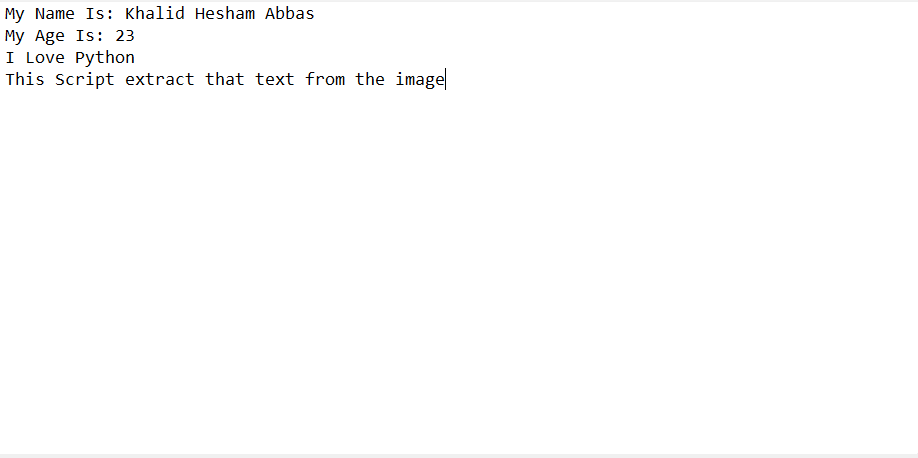
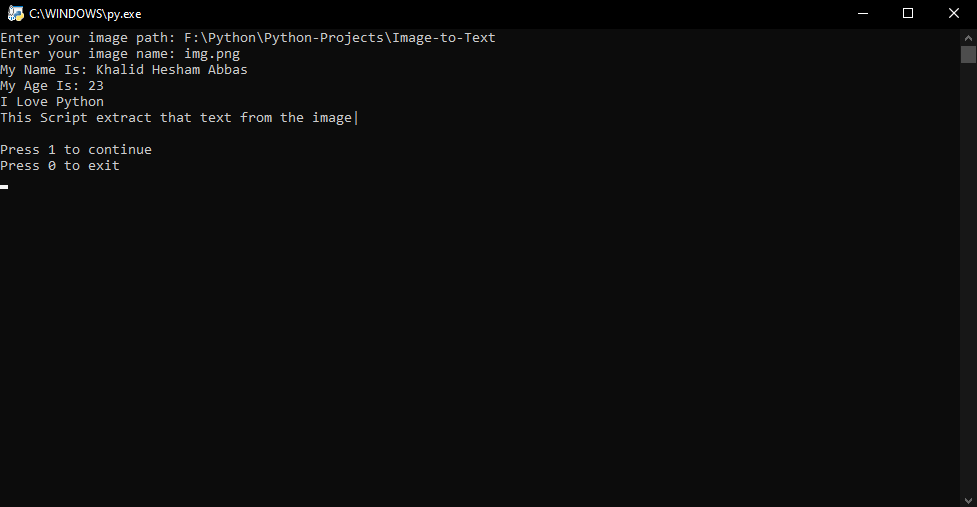

# Image Text Extraction in Python
This Python script uses Optical Character Recognition (OCR) to extract text from images. The script is powered by the `pytesseract` library, a Python wrapper for Google's Tesseract-OCR Engine, which is one of the most accurate and open-source OCR technologies available.

## Features
- **OCR Technology**: Extract text from any image using Tesseract, an industry-standard OCR engine.
- **Error Handling**: Detect and handle errors related to image file paths.
- **Cross-Platform Path Compatibility**: Ensure file path compatibility across different operating systems using the re module.

## Image


## Extracting Text


## Installation
Clone this repository and run the script:
```bash
git clone https://github.com/Khalid-Hesham/Python-Projects.git
cd Image-to-Text
python img2text.py
```

## Author

***Khalid Hesham***
