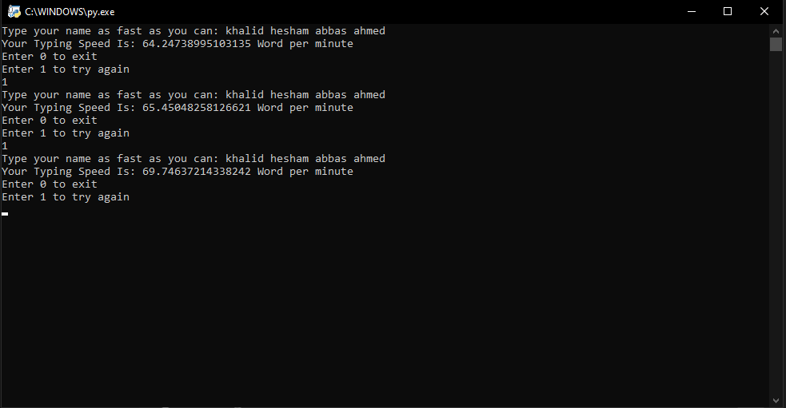

# Typing Speed Test in Python

This Python script allows you to test your typing speed. It calculates Words Per Minute (WPM) and Characters Per Minute (CPM) using a simple and intuitive interface.

## Features
- Real-time typing speed calculation
- Use of Python's `time` module for accurate timing
- Implementation of a decorator for clean code structure

## My Speed



## Installation
Clone this repository and run the script:
```bash
git clone https://github.com/Khalid-Hesham/Python-Projects.git
cd Typing-Speed-Test
python typing_speed.py
```

## Author

- ***Khalid Hesham***
