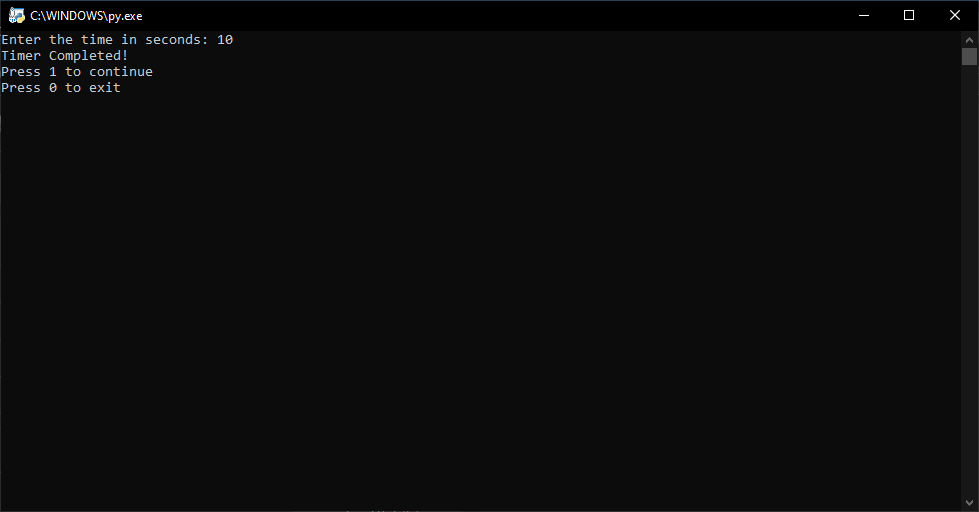

# Countdown Timer in Python
This Python script implements a simple countdown timer that takes input in seconds and counts down to zero, displaying the remaining time in a minute format. It utilizes the `time` module to manage the countdown and provide accurate timing.

## Features
- **Simple Countdown**: Enter the time in seconds, and the script will count down to zero.
- **Real-Time Display**: The remaining time is displayed in real-time in the format MM:SS.
- **Cross-Platform Compatibility**: Works on all platforms where Python and the time module are supported.

## Countdown 10 Seconds


## After Finishing


## Installation
Clone this repository and run the script:
```bash
git clone https://github.com/Khalid-Hesham/Python-Projects.git
cd countdown
python countdown.py
```

## Author

- ***Khalid Hesham***
