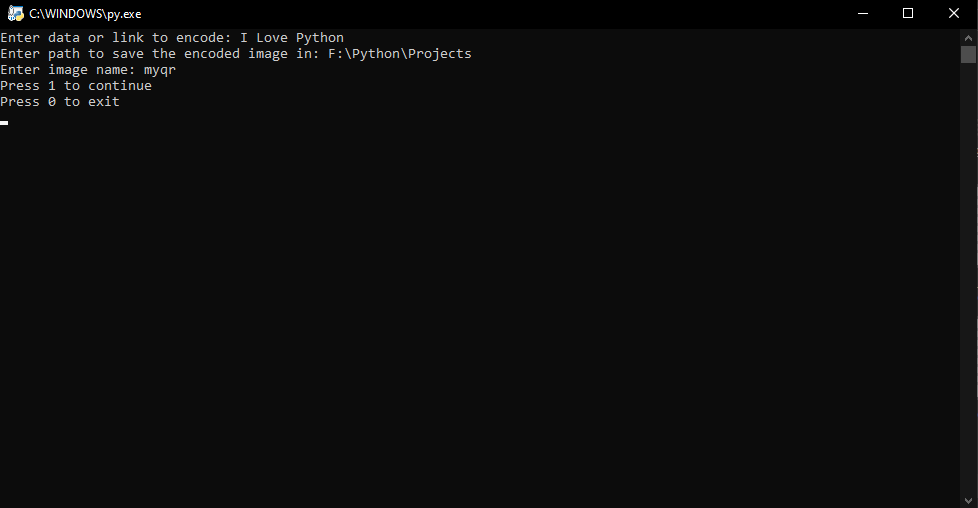
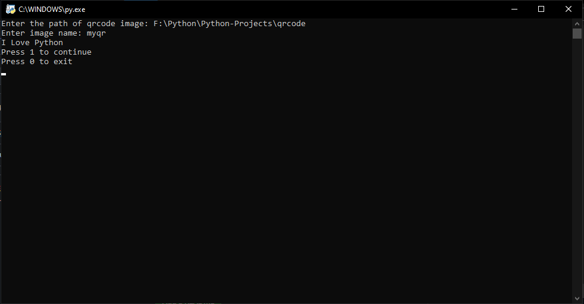

# QR Code Encoder in Python
This Python script allows you to encode any text or URL into a QR code and save it as an image. It uses the `qrcode` module for generating QR codes and the `re` module for handling file paths, providing an easy way to create and save QR codes from user input.

## Features
- Encode any text or URL into a QR code.
- Save the generated QR code image with a custom name to a specified directory.
- Path handling across different operating systems using the re module.

## QR Encoding


## Result


## QR Decoding


## Installation
Clone this repository and run the script:
```bash
git clone https://github.com/Khalid-Hesham/Python-Projects.git
cd qrcode
python qr_encoder.py
python qr_decoder.py
```

## Author

- ***Khalid Hesham***
